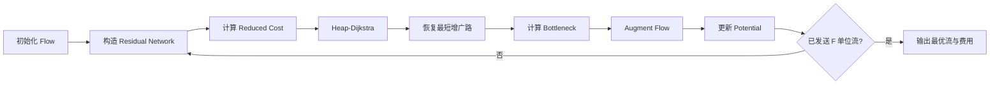
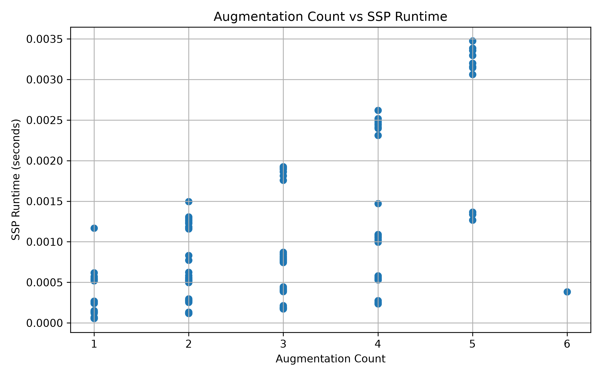
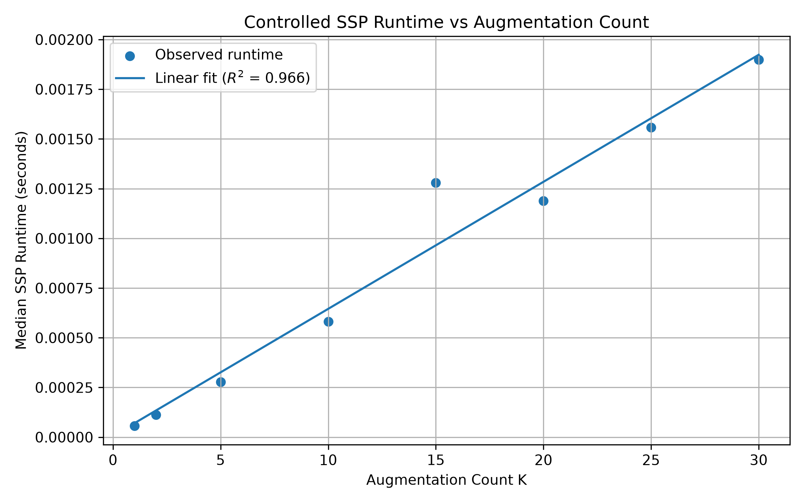

<div align="center">

# Minimum-Cost Flow Project

### 基于 Successive Shortest Path 的最小费用流算法实现与实验分析

Python · Graph Algorithms · Combinatorial Optimization · Gurobi

</div>

---

## 项目简介

本项目从零实现经典 **最小费用流问题（Minimum-Cost Flow）** 的 Successive Shortest Path（SSP）算法，并围绕算法正确性、运行时间和增广次数开展实验分析。

项目并非单纯调用优化求解器，而是完整实现：

- 残量网络（Residual Network）
- 正向弧与反向弧
- 最短增广路
- Heap-Dijkstra
- Potential
- Reduced Cost
- 流量增广
- SSP 主算法
- 解的可行性验证
- Gurobi 独立交叉验证
- 随机实例 Benchmark
- 多次重复计时
- 增广次数与 Runtime 分析
- Controlled Experiment

项目最终形成如下完整链路：

```text
数学模型
   ↓
算法设计
   ↓
Python 实现
   ↓
结果验证
   ↓
Gurobi 交叉验证
   ↓
随机 Benchmark
   ↓
统计分析
   ↓
受控实验
```

---

## 项目亮点

| 模块 | 当前状态 |
| --- | :---: |
| Successive Shortest Path | ✅ |
| Residual Network | ✅ |
| Heap-Dijkstra | ✅ |
| Potential / Reduced Cost | ✅ |
| Reverse Arc | ✅ |
| Capacity Validator | ✅ |
| Flow Conservation Validator | ✅ |
| Objective Validator | ✅ |
| Gurobi Cross Validation | ✅ |
| Random Instance Generator | ✅ |
| Multi-instance Benchmark | ✅ |
| Runtime Mean / Std | ✅ |
| Augmentation Analysis | ✅ |
| Controlled Experiment | ✅ |
| Linear Regression | ✅ |

---

# 1. 问题定义

给定有向网络 $G=(V,A)$。

其中：

- $V$：节点集合；
- $A$：有向弧集合；
- $u_{uv}$：弧 $(u,v)$ 的容量；
- $c_{uv}$：弧 $(u,v)$ 的单位费用；
- $x_{uv}$：弧 $(u,v)$ 上的流量；
- $s$：源点；
- $t$：汇点；
- $F$：需要从 $s$ 发送到 $t$ 的总流量。

目标是在满足容量约束和流守恒约束的条件下，使总费用最小：

`min Σ c_uv x_uv`

对应数学形式为：最小化所有弧上的“单位费用 × 流量”之和。

### 容量约束

对每条弧 $(u,v)$：

$0 \le x_{uv} \le u_{uv}$

### 流守恒

对于所有中间节点 $v\neq s,t$：

$\text{inflow}(v)=\text{outflow}(v)$

源点净流出为 $F$，汇点净流入为 $F$。

---

# 2. SSP 算法

本项目采用 **Successive Shortest Path Algorithm**。

核心思想是：

> 每一轮在当前残量网络中寻找一条最短费用的 $s-t$ 路径，然后沿该路径尽可能多地增广流量。

整体流程：



---

# 3. 残量网络

残量网络描述：

> 在当前流量解的基础上，还允许如何修改当前流。

对于原弧 $(u,v)$：

### 正向残量弧

如果 $x_{uv}<u_{uv}$，则还可以继续增加流量。

残量容量：

$r_{uv}=u_{uv}-x_{uv}$

残量费用：

$c^R_{uv}=c_{uv}$

### 反向残量弧

如果 $x_{uv}>0$，说明此前已经沿 $(u,v)$ 发送过流量。

此时残量网络加入反向弧 $(v,u)$。

残量容量：

$r_{vu}=x_{uv}$

残量费用：

$c^R_{vu}=-c_{uv}$

反向弧使算法能够：

> 撤销之前的一部分流量，从而修正过去的决策。

---

# 4. Potential 与 Reduced Cost

残量网络中的反向弧可能具有负费用，因此不能直接使用普通 Dijkstra。

为每个节点维护势函数 $p(v)$，定义约化费用：

$c_p(u,v)=c(u,v)+p(u)-p(v)$

算法维护 Potential，使 Dijkstra 使用的有效约化费用保持非负。

每轮 Dijkstra 得到约化距离 $d_p(v)$ 后更新：

$p(v)\leftarrow p(v)+d_p(v)$

Potential 的作用可以概括为：

```text
Residual Network 中存在负费用
                ↓
           Potential
                ↓
          Reduced Cost
                ↓
     非负边权的最短路问题
                ↓
           Dijkstra
```

---

# 5. 增广操作

假设当前最短增广路径为 $P$。

路径能够增加的最大流量由最小残量容量决定：

$\Delta=\min_{(u,v)\in P} r_{uv}$

同时还要考虑剩余需要发送的流量。

最终增广量为：

$\Delta=\min(\text{路径瓶颈容量},\text{剩余流量})$

如果经过正向残量弧：

$x_{uv}\leftarrow x_{uv}+\Delta$

如果经过反向残量弧：

$x_{uv}\leftarrow x_{uv}-\Delta$

---

# 6. 项目结构

```text
min-cost-flow-project/
│
├── main.py
├── min_cost_flow.py
├── gurobi_solver.py
├── examples.py
│
├── random_instance.py
├── test_random.py
├── experiments.py
├── analyze_instances.py
├── controlled_experiment.py
├── plot_results.py
│
├── experiment_results.csv
├── instance_results.csv
│
├── runtime_scaling.png
├── augmentation_vs_runtime.png
├── controlled_runtime_vs_augmentation.png
│
├── requirements.txt
├── README.md
└── .gitignore
```

### 主要文件说明

| 文件 | 功能 |
| --- | --- |
| `main.py` | 项目主程序 |
| `min_cost_flow.py` | SSP 核心算法 |
| `gurobi_solver.py` | Gurobi LP 模型 |
| `examples.py` | 基础测试实例 |
| `random_instance.py` | 随机网络生成器 |
| `test_random.py` | 随机实例正确性测试 |
| `experiments.py` | 多实例性能实验 |
| `analyze_instances.py` | 实验数据统计分析 |
| `controlled_experiment.py` | 受控增广实验 |
| `plot_results.py` | Runtime Scaling 绘图 |

---

# 7. 快速运行

## 安装依赖

```bash
python3 -m pip install -r requirements.txt
```

## 运行基础实例

```bash
python3 main.py
```

## 运行随机实验

```bash
python3 experiments.py
```

## 分析随机实例

```bash
python3 analyze_instances.py
```

## 运行受控实验

```bash
python3 controlled_experiment.py
```

---

# 8. 基础测试实例

当前基础网络：

```text
        3
   1 --------> 2
   |           |
 4 |           | 1
   ↓           ↓
   3 --------> 4
        2
```

需要发送：

$F=5$

最终流量：

| Arc | Flow |
| --- | ---: |
| $(1,2)$ | 3 |
| $(1,3)$ | 2 |
| $(2,4)$ | 3 |
| $(3,4)$ | 2 |

最终最小费用：

**18**

---

# 9. 自动结果验证

项目不会因为程序“成功运行”就默认结果正确。

目前包含三个 Validator。

### Capacity Validator

检查：

$0\le x_{uv}\le u_{uv}$

### Flow Conservation Validator

检查所有中间节点：

$\text{inflow}=\text{outflow}$

### Objective Validator

重新计算：

$\sum c_{uv}x_{uv}$

并与算法返回的 `total_cost` 比较。

正常输出：

```text
容量约束： PASS
流守恒：   PASS
目标函数： PASS
```

---

# 10. Gurobi 交叉验证

同一个最小费用流问题分别使用：

```text
自实现 SSP
      VS
Gurobi LP
```

进行求解。

验证条件：

$C_{\mathrm{SSP}}=C_{\mathrm{Gurobi}}$

当前测试实例及随机实验中，两种方法的最优目标值均保持一致。

这使项目形成：

```text
自实现算法
    ↓
Validator
    ↓
Gurobi Independent Check
```

而不是“自己写算法，再自己证明自己正确”。

---

# 11. 随机 Benchmark

实验规模：

| $|V|$ | $|A|$ |
| ---: | ---: |
| 20 | 80 |
| 50 | 200 |
| 100 | 400 |
| 200 | 800 |

每个规模生成多个随机实例。

记录：

- SSP Runtime
- Gurobi Runtime
- Augmentation Count
- Objective Consistency

为了降低系统调度和 Python 运行噪声，同一个 SSP 实例重复执行多次，并使用 **Median Runtime**。

---

# 12. Runtime Scaling

随机实例实验表明：

- 网络规模增加时，SSP Runtime 总体增加；
- 当前小规模稀疏网络中，专用 SSP 的运行时间低于通用 Gurobi LP 模型；
- 该结果不能解释为 SSP 在所有问题上均优于 Gurobi。

实验曲线：


---

# 13. 增广次数分析

记 SSP 的增广次数为 $K$。

采用 Heap-Dijkstra 时，可以粗略理解：

$T_{\mathrm{SSP}}=O(K(|V|+|A|)\log |V|)$

因此 Runtime 不仅受到 $|V|$ 和 $|A|$ 的影响，也受到 $K$ 的影响。

随机实验显示：

> 在固定网络规模之后，Augmentation Count 与 SSP Runtime 呈明显正相关。



这一结果与 SSP 的算法执行结构一致：

```text
一次 Augmentation
      ↓
一次 Shortest Path Search
      ↓
一次 Residual Network Update
```

---

# 14. Controlled Experiment

随机网络中，$|V|$、$|A|$、网络结构和 $K$ 会同时变化。

为了单独研究增广次数，本项目进一步设计受控实验。

固定：

- $|V|=32$
- $|A|=60$

构造 30 条彼此独立的路径：

$s\rightarrow v_i\rightarrow t$

每条路径容量均为 1。

因此发送 $F$ 单位流时：

$K=F$

测试：

$K=1,2,5,10,15,20,25,30$

并对同一个实验重复运行，使用 Median Runtime。

---

# 15. Controlled Experiment Result

实验结果：



进行线性回归：

$T\approx\beta_0+\beta_1K$

得到：

**$R^2=0.966$**

这意味着在当前受控实验设置中，简单线性模型可以解释约 **96.6%** 的 Runtime 变化。

因此实验支持：

> 当网络规模固定时，SSP Runtime 与增广次数表现出明显的近似线性增长关系。

需要强调：

**该实验是对算法运行机制的实验支持，而不是对理论复杂度的数学证明。**

---

# 16. 当前实验结论

目前可以得到以下阶段性结论：

1. 自实现 SSP 与 Gurobi 的最优目标值保持一致；
2. 三类 Validator 能够验证解的基本正确性；
3. 网络规模增加会提高 SSP 的运行时间；
4. Augmentation Count 是 SSP Runtime 的重要影响因素；
5. 固定网络规模后，Runtime 与 $K$ 呈明显正相关；
6. Controlled Experiment 中线性回归达到 $R^2=0.966$；
7. 实验现象与 SSP 的理论执行结构一致。

---

# 17. 当前限制

当前项目仍属于学习型算法工程项目，存在以下限制：

- 当前实例规模仍然较小；
- 随机网络生成方式较简单；
- SSP 数据结构仍有进一步优化空间；
- 尚未使用标准 Minimum-Cost Flow Benchmark 数据集；
- 尚未系统比较其他最小费用流算法；
- Python 实现存在解释器开销；
- 当前实验不能用于证明某种算法在所有场景下优于另一种算法。

---

# 18. 后续计划

后续可继续扩展：

- [ ] 更大的网络规模
- [ ] 标准 Benchmark 数据集
- [ ] 更困难的随机实例
- [ ] Cost Scaling Algorithm
- [ ] Network Simplex
- [ ] OR-Tools 对比
- [ ] SCIP 对比
- [ ] 单元测试
- [ ] Edge / Reverse Edge 数据结构重构
- [ ] Profiling
- [ ] 更多 Runtime Scaling 实验
- [ ] 算法复杂度与实验增长趋势比较

---

# 19. 学习目标

本项目用于训练完整的 Optimization Engineering 工作流：

```text
Problem Formulation
        ↓
Algorithm Design
        ↓
Data Structure
        ↓
Implementation
        ↓
Validation
        ↓
Solver Benchmark
        ↓
Experimental Design
        ↓
Statistical Analysis
```

核心能力包括：

- Python
- Data Structures
- Graph Algorithms
- Combinatorial Optimization
- Mathematical Programming
- Gurobi
- Algorithm Benchmarking
- Experimental Analysis
- Git / GitHub

---

<div align="center">

### Minimum-Cost Flow from Theory to Implementation

**Implement · Validate · Benchmark · Analyze**

</div>